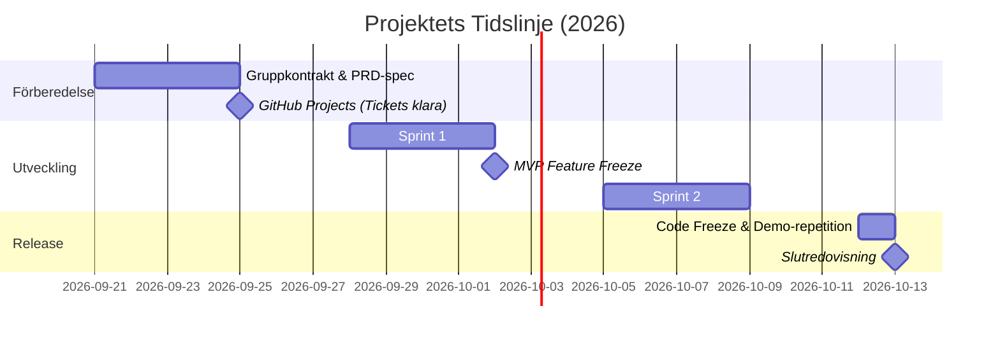

# 🛒 Webbshoppen – Kundportalen (Fas 2)

> **Front-end & Next.js Grupparbete – Lexicon 2026**  
> **Projektperiod:** 21 september 2026 – 13 oktober 2026 (v. 39 – v. 42)  
> **Slutredovisning:** Tisdag 13 oktober 2026

---

## 🎯 Välkommen till Fas 2!

I Fas 1 byggde ni ett fungerande internt admin-gränssnitt. Nu är det dags för det stora klivet: **att öppna butiken för konsumenterna**. 

I detta projekt agerar er grupp ett professionellt webb- och konsultteam. Ert uppdrag är att ta en befintlig produktkatalog och förvandla den till en modern, inbjudande och högpresterande e-handelsbutik byggd i **Next.js (App Router)**. Ni ska arbeta er igenom hela vägen från beställning till planering, genomförande och leverans av en första fungerande version av butiken.

---

## 🧭 Snabbnavigering i projektmaterialet

All dokumentation och alla mallar ni behöver under projektets gång finns samlade här:

| Dokument | Beskrivning | Syfte |
| :--- | :--- | :--- |
| 📋 **[PRD.md](./PRD.md)** | **Product Requirements Document** | Kundens specifikation, personas, MVP-krav, fördjupningsmoduler och er arbetsdel att fylla i. |
| 🤝 **[kontrakt.md](./kontrakt.md)** | **Gruppkontrakt** | Teamets gemensamma spelregler för närvaro, Teams-möten, AI-policy och samarbete. |
| 🎤 **[redovisning.md](./redovisning.md)** | **Redovisningsinstruktion** | Struktur och checklista inför slutdemon och presentationen den 13 oktober. |
| 🏛️ **[docs/ADR-mall.md](./docs/ADR-mall.md)** | **Architecture Decision Record** | Mall och exempel för att dokumentera era 1–2 viktigaste tekniska vägval. |
| 📖 **[docs/GLOSSARY.md](./docs/GLOSSARY.md)** | **Domänordlista** | Referensguide för e-handelsbegrepp, agila termer och Next.js-arkitektur. |

---

## 🚀 Kom igång: Steg-för-steg (Vecka 39)

Följ denna checklista under er första vecka:

1. **Välj kodbas från Fas 1:**  
   Gå igenom gruppmedlemmarnas tidigare kodbaser, jämför lösningar och välj ut den mest stabila basen att bygga vidare på.
2. **Skapa ett nytt gemensamt repo:**  
   En person skapar ett **nytt repo** på GitHub (t.ex. `grupp-X-webbshop`) och bjuder in samtliga medlemmar som *Collaborators*. Pusha er valda Fas 1-kod som första commit.
3. **Signera gruppkontraktet:**  
   Fyll i och bekräfta **[kontrakt.md](./kontrakt.md)** tillsammans. Diskutera ambitionsnivå och AI-policy.
4. **Fyll i er arbetsdel i PRD:n:**  
   Öppna **[PRD.md](./PRD.md)** och färdigställ sektion 5 (datamodell, User Stories med Given/When/Then, samt valda fördjupningsmoduler).
5. **Sätt upp GitHub Projects:**  
   Bryt ner era User Stories i konkreta issues/tickets. **Senast fredag 25 september** ska ert Kanban-bräde vara redo för sprintstart!

---

## 🗓️ Rekommenderade Milstolpar

* **V. 39 (21/9 – 25/9):** Uppstart, kontrakt, val av bas, PRD och tickets.
* **V. 40 (28/9 – 2/10):** Kodning drar igång! Fokus på MVP (Grid, Detaljsida, Sök/Filter, Paginering, Varukorg).
* **V. 41 (5/10 – 9/10):** Valda fördjupningsmoduler, styling, refaktorering och skrivande av ADR.
* **V. 42 (12/10 – 13/10):** Måndag 12/10: Code freeze och repetition. **Tisdag 13/10: Slutredovisning!**

---

## 📦 Vad innehåller leveransen vid slutpresentationen?

* **Fungerande live-applikation:** Byggd i Next.js App Router och demonstrerad live via Teams.
* **GitHub-repo:**
  * Välstrukturerad kod och tydlig commit-historik med pull requests.
  * Ifylld `PRD.md` och undertecknat `kontrakt.md`.
  * Minst 1 (max 2) välmotiverade `ADR`-dokument i `docs/`.
  * En ren och informativ `README.md` för er egen applikation.
* **Muntlig redovisning (15–20 min):** Enligt instruktionerna i **[redovisning.md](./redovisning.md)**.
